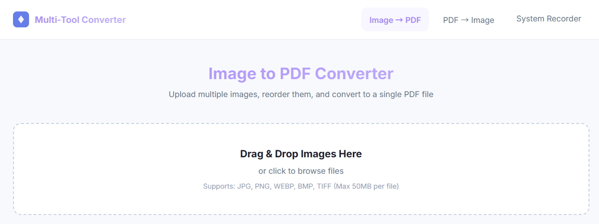

# Multi-Tool Web Converter



**Multi-Tool Web Converter**는 이미지와 PDF를 브라우저 또는 API를 통해 간편하게 변환할 수 있도록 만든 웹 기반 파일 변환 도구입니다.

사용자는 여러 이미지를 하나의 PDF로 만들거나, PDF 안에 포함된 이미지를 추출한 뒤 원하는 이미지 형식으로 내려받을 수 있습니다. 개발자는 FastAPI 기반의 간단한 구조를 바탕으로 새로운 변환 기능을 추가하거나 Docker로 배포할 수 있습니다.

## 무엇을 할 수 있나요?

- 여러 이미지 파일을 하나의 PDF로 병합할 수 있습니다.
- PDF 안에 포함된 이미지 객체를 추출할 수 있습니다.
- 추출한 이미지를 PNG, JPEG/JPG, WEBP 형식으로 다운로드할 수 있습니다.
- 선택한 이미지가 여러 개라면 ZIP 파일로 한 번에 받을 수 있습니다.
- `/health` 엔드포인트로 서비스 상태를 확인할 수 있습니다.

## 이런 경우에 유용합니다

- 스캔한 이미지 여러 장을 하나의 PDF로 정리하고 싶을 때
- PDF 문서 안에 들어 있는 원본 이미지를 별도로 저장하고 싶을 때
- 추출한 이미지를 웹에서 쓰기 좋은 포맷으로 바꾸고 싶을 때
- 간단한 파일 변환 API를 직접 실행하거나 확장하고 싶을 때

## 빠른 시작

### 1. 의존성 설치

```bash
pip install -r requirements.txt
```

### 2. 서버 실행

```bash
python main.py
```

기본 실행 주소는 다음과 같습니다.

- 애플리케이션: <http://localhost:8000/>
- 상태 확인: <http://localhost:8000/health>
- API 문서: <http://localhost:8000/docs>

> 참고: 현재 코드에서는 `/static` 정적 파일 경로를 사용하지만, 이 저장소에는 `static/` 디렉터리가 포함되어 있지 않습니다. 웹 화면이 필요한 경우 정적 프론트엔드 파일을 추가해야 합니다. API 문서는 FastAPI의 `/docs`에서 확인할 수 있습니다.

## Docker로 실행하기

Docker Compose를 사용하는 방법이 가장 간단합니다.

```bash
docker-compose up -d
```

실행 후 <http://localhost:8000>으로 접속할 수 있습니다.

자세한 Docker 사용법은 [Docker 배포 가이드](./README.docker.md)를 참고하세요.

## 개발자를 위한 문서

README는 사용자 관점의 개요와 실행 방법에 집중합니다. 프로젝트 내부 구조와 기술적인 설명은 아래 문서를 참고하세요.

- [프로젝트 전체 설명](./docs/PROJECT_OVERVIEW.md)
- [디렉터리 구조 설명](./docs/DIRECTORY_STRUCTURE.md)
- [Docker 배포 가이드](./README.docker.md)

## 주요 API

| 메서드 | 경로 | 용도 |
| --- | --- | --- |
| `GET` | `/health` | 서버 상태 확인 |
| `POST` | `/api/convert/image-to-pdf` | 여러 이미지를 하나의 PDF로 변환 |
| `POST` | `/api/convert/pdf-to-image` | PDF에서 이미지 추출 |
| `POST` | `/api/convert/download-images` | 추출 이미지를 이미지 파일 또는 ZIP으로 다운로드 |

API의 상세 요청/응답 형식은 서버 실행 후 <http://localhost:8000/docs>에서 확인할 수 있습니다.

## 기본 제한 사항

- 파일당 기본 최대 크기는 50MB입니다.
- 이미지 → PDF 변환은 요청에 포함된 파일 순서를 따릅니다.
- PDF 이미지 추출은 PDF 내부의 이미지 객체를 대상으로 하며, 텍스트나 벡터 그래픽은 이미지로 추출되지 않을 수 있습니다.
- 설정값은 환경 변수 또는 `.env` 파일로 조정할 수 있습니다.

## 라이선스

현재 저장소에는 별도의 라이선스 파일이 포함되어 있지 않습니다. 사용 또는 배포 전에 프로젝트 소유자에게 라이선스 정책을 확인하세요.
